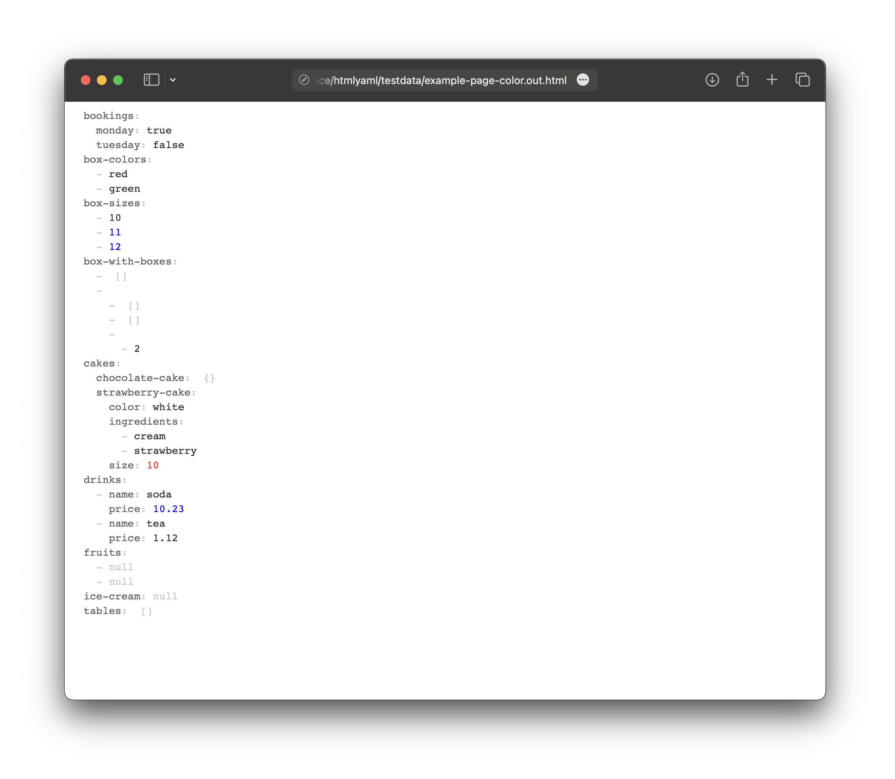

## 🐹 htmlyaml: rich rendering of YAML as HTML in Go

[](https://codecov.io/gh/nikolaydubina/htmlyaml)
[](https://goreportcard.com/report/github.com/nikolaydubina/htmlyaml)
[](https://pkg.go.dev/github.com/nikolaydubina/htmlyaml)

* pure Go
* no Javascript
* no dependencies
* no `reflect`
* no `fmt`
* no `text/template`, `html/template`
* 300 LOC
* customizable rendering
* JSON Path for elements access



```go
// YAML has to be any
var v any
yaml.Unmarshal(exampleYAML, &v)

htmlPage := htmlyaml.DefaultPageMarshaler.Marshal(v)
```

```go
// YAML has to be any
var v any
yaml.Unmarshal(exampleYAML, &v)

// customize how to render HTML elements
s := htmlyaml.DefaultMarshaler
s.Number = func(k string, v float64, s string) string {
    if k == "$.cakes.strawberry-cake.size" {
        return `<div class="yaml-value yaml-number" style="color:red;">` + s + `</div>`
    }
    if v > 10 {
        return `<div class="yaml-value yaml-number" style="color:blue;">` + s + `</div>`
    }
    return `<div class="yaml-value yaml-number">` + s + `</div>`
}

m := htmlyaml.DefaultPageMarshaler
m.Marshaler = &s

// write HTML page
htmlPage := m.Marshal(v)
```
